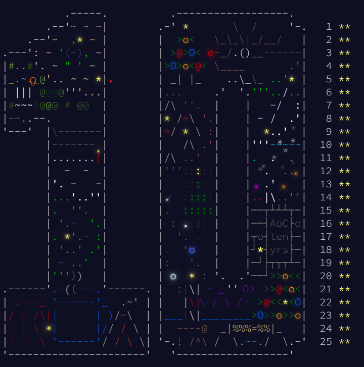

# advent_of_code_2024
[](https://adventofcode.com/2024)
[](https://go.dev/)


Solutions of Advent Of Code 2024 in Go




| Day   | Solution 1           | Solution 2           | Time          |
|-------|----------------------|----------------------|---------------|
| 01    | 2367773              | 21271939             | 1.133624ms    |
| 02    | 402                  | 455                  | 0.932973ms     |
| 03    | 187825547            | 85508223             | 1.974232ms    |
| 04    | 2401                 | 1822                 | 1.053653ms    |
| 05    | 4996                 | 6311                 | 0.527601ms     |
| 06    | 4722                 | 1602                 | 132.529213ms  |
| 07    | 12839601725877       | 149956401519484      | 774.967604ms  |
| 08    | 273                  | 1017                 | 0.287586ms     |
| 09    | 6448989155953        | 6476642796832        | 16.069776ms   |
| 10    | 644                  | 1366                 | 3.682579ms    |
| 11    | 199986               | 236804088748754      | 47.600853ms   |
| 12    | 1461752              | 904114               | 11.6792ms     |
| 13    | 37128                | 74914228471331       | 3.953839ms    |
| 14    | 229868730            | 7861                 | 63.484596ms   |
| 15    | 1527563              | 1521635              | 1.947405ms    |
| 16    | 95476                | 511                  | 254.512624ms  |
| 17    | 4,1,7,6,4,1,0,2,7    | 164279024971453      | 2.373951ms    |
| 18    | 320                  | 34,40                | 168.21975ms   |
| 19    | 322                  | 715514563508258      | 13.336857ms   |
| 20    | 1485                 | 1027501              | 187.314378ms  |
| 21    | 248684               | 307055584161760      | 0.256262ms     |
| 22    | 21147129593          | 2445                 | 491.829853ms  |
| 23    | 1366                 | bs,cf,cn,gb,gk,jf,mp,qk,qo,st,ti,uc,xw | 10.30702ms |
| 24    | 51107420031718       | cpm,ghp,gpr,krs,nks,z10,z21,z33 | 0.382251ms |
| 25    | 2840                 |                      | 0.635332ms     |

## Build instructions

You can build test and run executables for all days with the following commands:
```bash
go build ./day*
go test ./day*
for i in (seq -w 1 25) ; go run ./day$i ; end
```